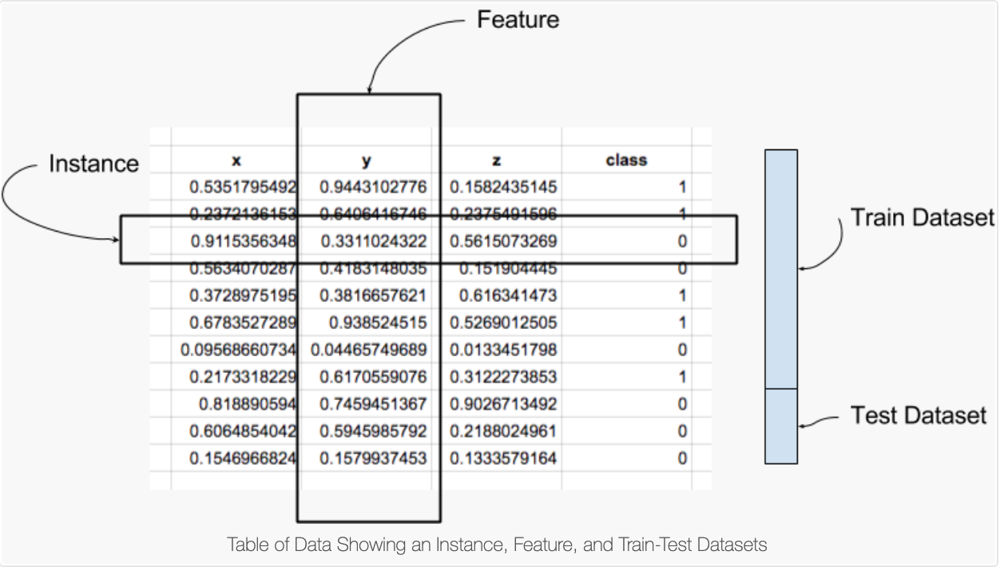

### Chapter 1 
Good general overview of machine learning.

### Chapter 2
End-to-end project: California housing prices' model and price prediction. 

Breaks down RMSE and MAE well, for a person with a rusty math.

Creating virtualenv (separate for each project) is well explained. Hoever, for those with Anaconda package management tool installed, the process is a bit different. See my post on creating a virtualenv with conda in [Link](../today-i-learned#jupyter-notebook-fails-to-start-on-mac)

One paragraph on p.50 quickly mentions a method of validating the last byte of a hash as a method of splitting into training and test sets. To explain this hash method some more:

#### After computing the hash, what is the significance of keeping only the last byte of the hash

We need a solution to sample a unique test-set even after fetching a updated dataset. SOLUTION: to use each instance's identifier to decide whether or not it should go to test_set. {Assuming that the instances have a unique and immutable identifier, we could compute a hash of each instance's identifier, keep only the last bytes of the hash, and put the instance in the test set if value is <= 256*test_ratio i.e 51}

This ensures that the test-set will remain consistent across multiple runs, even if you refresh the dataset. The new test_set will contain 20% of the new instances, but it will not contain any instance that was previosly in the train_set. First, a quick recap on hash functions:

A hash function f(x) is deterministic, such that if a==b, then f(a)==f(b).
Moreover, if a!=b, then with a very high probability f(a)!=f(b). With this definition, a function such as f(x)=x%12345678 (where % is the modulo operator) meets the criterion above, so it is technically a hash function.However, most hash functions go beyond this definition, and they act more or less like pseudo-random number generators, so if you compute f(1), f(2), f(3),..., the output will look very much like a random sequence of (usually very large) numbers.
We can use such a "random-looking" hash function to split a dataset into a train set and a test set.

Let's take the MD5 hash function, for example. It is a random-looking hash function, but it outputs rather large numbers (128 bits), such as 136159519883784104948368321992814755841.

For a given instance in the dataset, there is 50% chance that its MD5 hash will be smaller than 2^127 (assuming the hashes are unsigned integers), and a 25% chance that it will be smaller than 2^126, and a 12.5% chance that it will be smaller than 2^125. So if I want to split the dataset into a train set and a test set, with 87.5% of the instances in the train set, and 12.5% in the test set, then all I need to do is to compute the MD5 hash of some unchanging features of the instances, and put the instances whose MD5 hash is smaller than 2^125 into the test set.

If I want precisely 10% of the instances to go into the test set, then I need to checkMD5 < 2^128 * 10 / 100. This would work fine, and you can definitely implement it this way if you want. However, it means manipulating large integers, which is not always very convenient, especially given that Python's hashlib.md5() function outputs byte arrays, not long integers. So it's simpler to just take one or two bytes in the hash (anywhere you wish), and convert them to a regular integer. If you just take one byte, it will look like a random number from 0 to 255. If you want to have 10% of the instances in the test set, you just need to check that the byte is smaller or equal to 25. It won't be exactly 10%, but actually 26/256=10.15625%, but that's close enough. If you want a higher precision, you can take 2 or more bytes.



One possible implementation of train-test split of a dataset when each instance has a unique and immutable identifier:
```python
import numpy as np
import hashlib

def test_check_set(id, test_ratio, hash):
  return hash(np.int64(id)).digest()[-1] < 256 * test_ratio

def split_train_test_by_id(data, test_ratio, id_column, hash=hashlib.MD5):
  ids = data[id_column]
  in_test_set = ids.apply(lambda id_: test_set_check(id_, test_ratio, hash))
  return data.loc[~in_test_set], data.loc[in_test_set]
```
If there is no unique identifier, use row index as an ID:
```python
housing_with_id = housing.reset_index() # adds an `index` column 
train_set, test_set = split_train_test_by_id(housing_with_id, 0.2, "index")
```
If you use the row index as a unique identifier, you need to make sure that new data gets appended to the end of the dataset, and no row ever gets deleted. If this is not possible, then you can try to use the most stable features to build a unique identifier. For example, a district’s latitude and longitude are guaranteed to be stable for a few million years, so you could combine them into an ID like so:
```python
housing_with_id["id"] = housing["longitude"] * 1000 + housing["latitude"]
train_set, test_set = split_train_test_by_id(housing_with_id, 0.2, "id")
```
But, Scikit-Learn has a function for it:
```
from sklearn.model_selection import train_test_split
train_set, test_set = train_test_split(housing, test_size=0.2, random_state=42)
print(test_set.head())
```